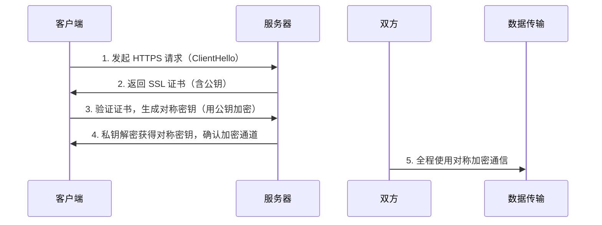

HTTPS（HyperText Transfer Protocol Secure）是在 HTTP 协议基础上通过 SSL/TLS 协议实现加密传输、身份认证和完整性保护的安全通信协议。它与 HTTP 的核心区别如下：

### 一、核心区别
1. **安全性（核心区别）**  
   - **HTTP**：  
     数据传输完全**明文**（未加密），易被中间人攻击截获敏感信息（如密码、银行卡号）。  
   - **HTTPS**：  
     采用 **SSL/TLS 加密**传输数据，结合**对称加密**（高效处理数据）和**非对称加密**（安全交换密钥），同时提供**服务器身份认证**（通过 CA 机构颁发的证书）和**数据完整性验证**（防止篡改）。

2. **默认端口**  
   - HTTP 默认使用 **80 端口**。  
   - HTTPS 默认使用 **443 端口**。这是通信协议层的根本性差异。

### 二、次要差异
3. **性能开销**  
   - HTTPS 因加密/解密操作**略慢于 HTTP**（约增加 12 个数据包），但现代硬件优化已大幅缩小差距，实际体验差异可忽略。

4. **部署成本**  
   - HTTPS 需向 **CA（证书颁发机构）付费购买 SSL 证书**（部分免费证书可用），HTTP 无需额外成本。

5. **浏览器标识**  
   - HTTP 站点在浏览器中会被标记**「不安全」**（如 Chrome 的红色警告）。  
   - HTTPS 站点显示**「安全锁」标识**（增强用户信任）。

6. **协议栈差异**  
   ```mermaid
   graph LR
     HTTP --> TCP
     HTTPS --> SSL/TLS --> TCP
   ```
   HTTPS 在 HTTP 和 TCP 之间新增 **SSL/TLS 加密层**（关键安全屏障）。

### 三、HTTPS 工作原理

> *注：非对称加密用于安全交换对称密钥，后续通信使用对称加密（兼顾效率与安全）。*
